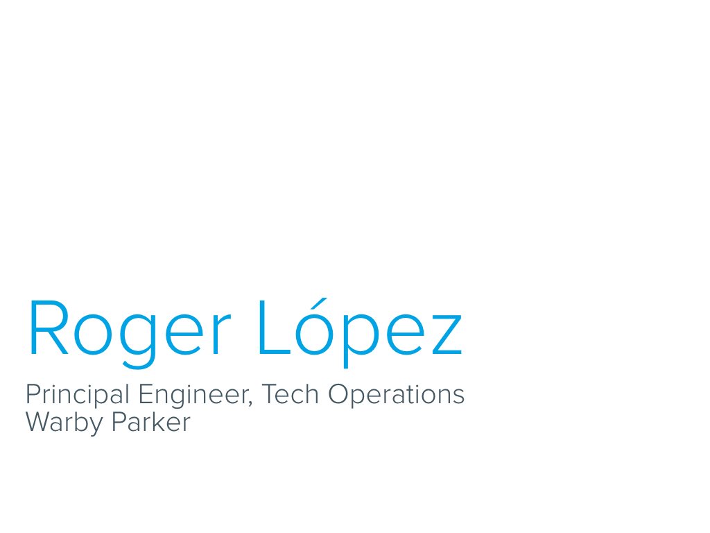
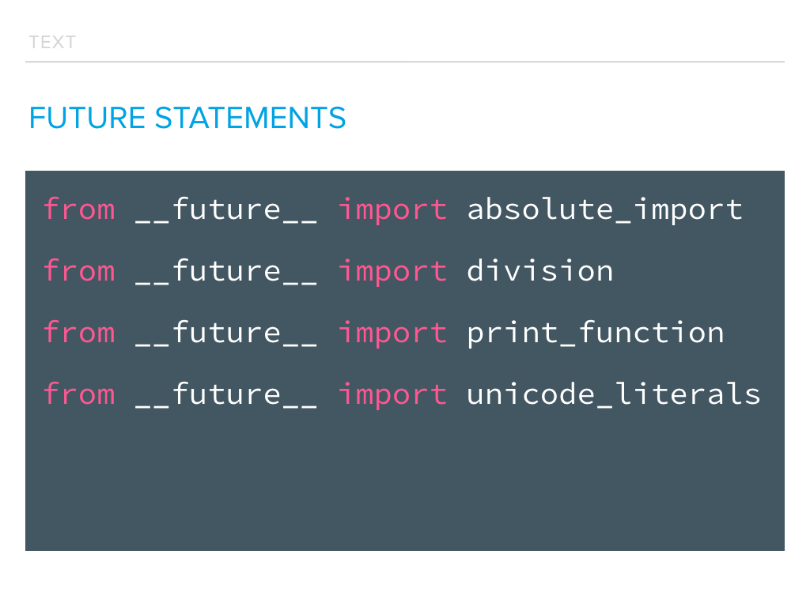
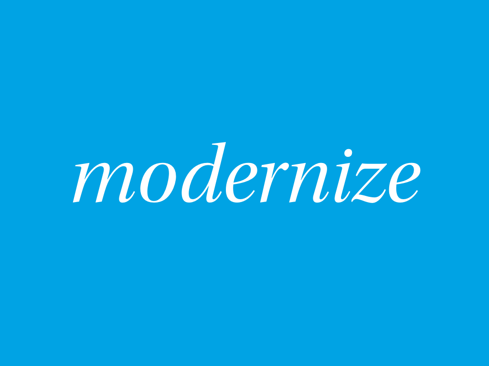

Python 3 is not a new thing. Just take a look at these release dates.

Even if we ignore everything before Python 3.3 (which is commonly considered
"modern" Python 3), it's been around for over three years. I'm not here to
convince you that Python 3 is better than Python 2. I'll let you make that
decision for yourself. However, I do want to convince you that migrating your
code is possible.

Before I get into it though, let me introduce myself. My name is Roger López,
and I'm a principal engineer on the tech operations team at Warby Parker.

Warby Parker, for those of you who might not be familiar with us, is a lifestyle
brand with the lofty objective of offering designer eyewear at a revolutionary
price, while leading the way for socially conscious business. For every pair of
glasses sold, Warby Parker distributes a pair to someone in need.

Our engineering team builds and maintains applications that run our e-commerce
sites, our retail stores, our customer experience suite, our supply chain and
many other aspects of our business. These applications are the very essence of
“mission critical”.

We have around 60 engineers, doing on average over 300 deploys a month, (or
around 20 deploys a day). We work primarily in one repository, which has a mix
of python 2, python 3 and nodejs code.

The vast majority of that code (129k lines) was written for Python 2. We've
started building new applications and services in Python 3, and we're becoming
really interested in migrating the Python 2. But given how much of our business
runs on those Python 2 applications, we have to find a way to do it without
impacting the business or disrupting the development team. So the goal is this:

So let's talk a little about software migrations in general.

I was a little surprised when I looked up the definition of "migrate", and found
a definition related to computing. This short definition certainly captures the
outcome of a migration, but it doesn’t speak to how migrations occur. This kind
of overly simplistic definition makes me think of what we often call the
“Indiana Jones swap”. 

The Indiana Jones swap is when you take one project and replace it completely
with another, in one fell swoop, like Indy is about to do here. He brings with
him a bag of sand, and hopes he can leave with the shiny golden idol. What
could go wrong?

In development, this usually means developing a shiny new piece of code, that we
hope to switch out for the bag of dirt that is the current code. The only thing
the two branches have in common is that you really hope one can pass for the
other for long enough to escape. Your shiny new code is developed in a separate
branch because the two things can’t co-exist. The whole time we’re doing this we
know we’ll eventually have to make the swap, and when we do, there will probably
be booby traps. But what could go wrong? We’re Indiana Jones, after all.

Just as we expected, the swap is a disaster. We have to merge this giant branch
into master. There are tons of conflicts. We manually fixing the conflicts and
lose code that others have been working on. We finally get to deploying the new
code and now everything’s broken. And none of the other developers know how
anything works in this shiny new codebase. With every obstacle you overcome, you
realize you still have a giant boulder bearing down on you.

I think it goes without saying, but we should avoid this type of migration at
all cost. No matter how cool it looks.

Now that we’ve gotten that out of the way, let’s talk about a more sane
strategy, namely preparatory refactoring. Last year Martin Fowler posted this
image in an article about preparatory refactoring, along with this quote from
Jessica Kerr:

	It’s like I want to go 100 miles east but instead of just traipsing
	through the woods, I’m going to drive 20 miles north to the highway and
	then I’m going to go 100 miles east at three times the speed I could
	have if I just went straight there. When people are pushing you to just
	go straight there, sometimes you need to say, “Wait, I need to check the
	map and find the quickest route.” The preparatory refactoring does that
	for me.

	-- Jessica Kerr

Jessica here is talking about the quickest route, but this same metaphor works
for goals other than speed. You might need to backtrack for an easier route or
a safer route, but the metaphor still holds true.

After reading this, it was pretty clear to me that migration is much more about
refactoring than new feature development. So let’s take a step back to make sure
we understand refactoring.

According to Martin Fowler:

Refactoring is disciplined. Refactoring doesn’t change external behavior.
Refactoring is not feature development. 

Preparatory refactoring is a very specific type of refactoring, in which we
restructure our code to prepare for a new feature. If there is a feature we want
to add, but our existing code structure doesn't immediately support that
feature, then we can refactor the code into a structure that makes it easy to
add the feature. Or in the words of Kent Beck:

	
In our case, we're going to do the hard work of making our application
forward-compatible, so we can then make easy change of running it on Python 3.

So in addition to our goal, we’ven now got a plan.

We’re going to do the hard work of making our application forward-compatible,
so we can then make easy change of running it on Python 3.

At the heart of refactoring is preserving existing behavior. Obviously, to make
sure this happens, we're going to run our test suite after every change we make.
And to make sure the changes we're making are preparing us for Python 3, we want
to run the same test suite against python 3. Luckily there's a tool that can
help us out with this.

Tox is a package that gives us a way to easily run commands in different virtual
environments. Tox manages the setup of these environments for us before each
test run.

With each environment we set up, tox takes the following steps.

1. First tox will create an virtualenv for the specified tox
   environment. Each environment is completely isolated.
2. Next tox will install any dependencies we specify, into the
   virtualenv.
3. Then tox will build and install the application into the virtualenv. 
   This assumes that your application has a setup.py and can be
   installed with `setup.py sdist`. Don’t worry if this isn’t the case
   for your application, there’s a work-around.
4. And finally, tox will run each of the commands that you specified in
   the virtualenv.

As I mentioned before, Tox works most easily if you ship your application as a
standard python package with a setup.py file. Assuming you use pytest and have
python2.7 and python3.5 executables on your system, this tox.ini will configure
tox to run pytest against both python versions.

	[tox]
	envlist = py27,py35

	[testenv]
	deps=pytest
	commands=py.test

We’ve defined 2 environments here, py27 and py35. Tox understands environments
in this format and will map each of them to the expected python version.

The `[testenv]` section is a set of defaults for each of the environments. In
this example, we’ve specified pytest in the dependencies and the commands.

If you don't use setup.py to distribute your application, there's a small amount
of extra configuration needed. Let's assume you run your tests with a command
like `manage.py test` and you have your requirements in the usual
`requirements.txt`. 

	[tox]
	envlist = py27,py35
	skipsdist = True

	[testenv]
	deps = -r{toxinidir}/dev-requirements.txt
	setenv =
	    PYTHONPATH = {toxinidir}
	    commands = python manage.py test

This configuration tells tox to skip the `setup.py sdist` step, and instead
install dependencies from your `requirements.txt` file. We also need to set the
`PYTHONPATH` environment variable to the location of our source code, since we
aren't actually installing our application into the virtualenv.

Regardless of how the application is built, we now have a way to verify that we
haven't changed the existing behavior, while also making sure that we're
preparing for python 3.

But before we start changing our code, we should make sure that all of our
dependencies are compatible with python 3. There are some great tools out there,
like this one, the Python 3 Wall of Superpowers that give us a view of the
compatibility of the top python packages according to PyPI.  At the time of
this screenshot, 174 out of 200 (87%) of the most popular packages were
labelled as compatible with Python 3.

Python 3 readiness is another, very similar project.  This one reports that 319
out of 360 (88%) of the most popular packages are ready.

These tools serve a really important purpose, giving us an overview of the
Python ecosystem as a whole. But what we’re really concerned with is our
specific dependencies.

An even better resource is Can I Use Python 3 (https://caniusepython3.com). This
site will give you a full compatibility report of your exact requirements.  And
for any requirements that are not compatible, it will tell you if any of those
have direct dependencies that would block them from being upgraded. We can use
this information to determine the path forward for our specific application.

So what are our options when dependencies aren't compatible?

- Ignore it: Maybe this is a package that is a backport of a python 3
  feature.
- Remove it: Maybe it's easier to remove the dependency on this library
  than it is to deal with upgrading it.
- Replace it: Maybe there's a similar library that is compatible that
  could be used instead.
- Fix it: Get it fixed upstream! Contribute to open-source.

Now that our dependencies are all sorted out, we can finally get to work on our
own application code. 

`__future__` is the first place you should start if you want to write python 3
compatible code.  PEP 236 introduces a strategy for opting into language
features that will be officially released as part of a future python release.
The way it does this is with future statements. Future statements look just like
normal import statements, with a few caveats. A future statement must appear
near the top of the module. The only lines that can appear before a future
statement are the module docstring (if any), comments, blank lines, and other
future statements.

Even though they look like normal import statements, they are very different. A
future statement is recognized and treated specially at compile time: Depending
on which feature is specified, the compiler may need to parse the module with a
different syntax or generate different bytecode. At runtime, the future
statement acts just like any other import.  The standard library provides a
module named `__future__` which has Feature objects representing each of the
features.  These objects contain information about the feature, but are
more-or-less useless at runtime.

The python 3 features available in python 2.6+ are:

`absolute_import`: PEP 328: Imports: Multi-Line and Absolute/Relative
`division`: PEP 238: Changing the Division Operator
`print_function`: PEP 3105: Make print a function
`unicode_literals`: PEP 3112: Bytes literals in Python 3000

Each of these features allows us to write code that is more compatible with
python 3. And unlike the compatibility libraries we'll talk about later, these
imports can change the way our code is compiled.

To take it a little further, we'll look at the six module.

Six is a Python 2 and 3 compatibility library. It provides utility functions for
smoothing over the differences between the Python versions with the goal of
writing Python code that is compatible on both Python versions. ... Six supports
every Python version since 2.6. It is contained in only one Python file, so it
can be easily copied into your project.

Think of Six as the the swiss-army knife for python compatibility. It's very
small and is easily integrated into your project.  Here are some examples:

dict.iteritems() becomes dict.items()

	# py2
	for k, v in d.iteritems():
            pass

	# py3
	for k, v in d.items():
	    pass

	# six
	import six
	for k, v in six.iteritems(d):
	    pass

metaclass syntax:

	# py2
	class MyClass(object):
	    __metaclass__ = MyMeta

	# py3
	class MyClass(object, metaclass=Meta):
	    pass

	# six
	@six.add_metaclass(Meta)
	class MyClass(object):
	    pass

moved modules:

	# py2
	import HTMLParser as html_parser

	# py3
	import html.parser as html_parser

	# six
	from six.moves import html_parser

So now we know how to write python 3 compatible code, but this seems like its
gonna be a lot of manual work. It would be great if we could automate this. The
only tool I knew of that did anything close to this was 2to3.

"2to3 is a Python program that reads Python 2.x source code and applies
a series of fixers to transform it into valid Python 3.x code. The
standard library contains a rich set of fixers that will handle almost
all code."

Although we're not migrating directly to py3 code, could we still use 2to3 to
show us where we have py3 incompatible code, so we can go replace it with py3
code? Let's try this with a simple example.

	d = {
	    'foo': 'bar',
	    'baz': 'qux',
	}

	for k, v in d.iteritems():
	    print '%s => %s' % (k, v)

And now we'll run 2to3 against this:

	$> 2to3 example-2to3.py
	RefactoringTool: Refactored example-2to3.py
	--- example-2to3.py	(original)
	+++ example-2to3.py	(refactored)
	 @@ -3,6 +3,6 @@
	     'baz': 'qux',
	 }
	-for k, v in d.iteritems():
	-    print '%s => %s' % (k, v)
	+for k, v in d.items():
	+    print('%s => %s' % (k, v))

This looks promising. We can't use the new code that 2to3 is suggesting, but we
can clearly see where we need to do our refactoring with `__future__` and `six`.

	from __future__ import print_function
	import six

	d = {
	    'foo': 'bar',
	    'baz': 'qux',
	}

	for k, v in six.iteritems(d):
	    print('%s => %s' % (k, v))

And now we can run `2to3` again, and see that we're compatible!

	$> 2to3 example-2to3.py
	RefactoringTool: No changes to example-2to3.py
	RefactoringTool: Files that need to be modified:
	RefactoringTool: example-2to3.py

So yes, we can use 2to3 to find the places where our code is not compatible.
But the refactoring is still going to be pretty tedious. Wouldn't it be nice if
there was a tool like 2to6?

There is.  It's called python-modernize.

This seems perfect. Let's try it on our example:

	$ python-modernize example-2to3.py
	RefactoringTool: Refactored example-2to3.py
	--- example-2to3.py	(original)
	+++ example-2to3.py	(refactored)
	@@ -1,8 +1,11 @@
	+from __future__ import absolute_import
	+from __future__ import print_function
	+import six
	 d = {
	      'foo': 'bar',
	           'baz': 'qux',
	 }
	-for k, v in d.iteritems():
	-    print '%s => %s' % (k, v)
	+for k, v in six.iteritems(d):
	+    print('%s => %s' % (k, v))

As it turns out, modernize did everything we did in our refactor and more.

So in conclusion:

- Practice preparatory refactoring.
  Don't be Indiana Jones. Refactor for forward-compatibility.
- Preserve current behaviors, using Tox to testa against both Python 2 & 3.
- Evaluate your dependencies for compatibility.
  Have a plan for incompatible dependencies.
- Use `__future__` and `six` to write forward-compatible code.
- Use `python-modernize` to automate the refactoring.

